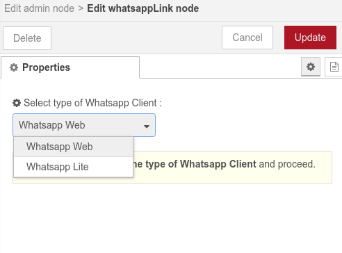

# Whatsapp Link :iphone:

Simple node for connecting Node-Red to Whatsapp :iphone:

Currently in developing mode, Continous updated may encounter. :sweat_smile: 


## To Connect with Whatsapp 


1. Deploy whatsapp admin node (along with whatsappLink node).
2. whatsappLink node will initilize, connect with whatsapp and generate a <b>QR code below the Admin Node </b> (in terminal also).
3. Scan the QR code with your Whatsapp Mobile App (Go to settings > Linked device > Scan & Connect).
4. Done - Whatsapp Connected.
5. Send "`!nodered`" to get a reply from Node-Red  in Chats/Groups. 

### if Whatsapp Web not working ?
Their is lite version also avilable in it. Totally different from Whatapp-Web,
Whatsapp-Lite (Beta Mode) works on Web-Sockets only, It might work for you also.

Simply chosse `Whatsapp Lite` in Whatsapp-Link configration node. 




 *It will create a Whatsapp Web instance in your machine and store your session locally in Node-RED. All data are store in users  `<user>/.node-red/Whatsapp-Link` folder. Near you Node-Red's settings.js file.*
 

## Nodes
1. **Whatsapp Admin** : Node used for  first time users to connect with whatsapp and other admin related tasks. </br>
Admin Node generate QR Code just below the node for easy connection with whatsapp. 

    

    | Inputs | Description           |
    |--------|--------------         |
    | test   | Checks the current status of whatsapp and output the same in `msg.payload`|
    | destroy| Close the client and destroy the whatsapp connection.|
    | restart | Restart the whatsapp connection. |
    | logout | Simply log you out and close the session. |
    ---
    
    
    | Output | Description |
    |--------| ------------|
    |`status` | provide status on `msg.payload` for all and each input mentioned in above table. |
    | Connecting..| When whatsapp attempting to connect.
    | QR Code (image) | when QR code is generated. *This method can also be used to get QR Code (image) generated by whatsapp.*
    | Connected | When whatapp is sucessfully connected.|
    | Group Joined or Removed | `msg.paylod` : Group Name. </br> `msg.type` : joined / Removed from group.</br> `msg.notification` : Complete notification. </br> `msg.chat` : Complete Group Details. 
    

2. **Chats In** : Node to recive all messages send to connected number.
    -  Simply deploy the node and wait for green (connected) status.
    -  After succesfully connection, Node is able to recive all messages.

    | Output | Description |
    |--------|-------------|
    | `msg.paylod` | Recived message |
    | `msg.from`   | Sender Number |
    | `msg.chatID` | Chat ID of Group chat / Personal chat |
    | `msg.message` | Complete message object. <br />*Some extra details for advance users* |

    Their are many other events options avilable along with `message` event in Chats-In Node. For details refer documentation for Chats-In Node. 


3. **Chats / Group Out** : As simple as mention on name, node will send `msg.payload` recived at input to the number mentioned in node.
`A-reply-to-All.json` example is avilable in examples to import.

    MultiMedia Message: Requirments-
    | Input | Description |
    |--------|-------------|
    | `msg.image` | Base64 (encoded image) |
    | `msg.payload`   | Image Caption |
    | `msg.toNumber` | Reciver number (if number not provided in node) |

    Don't forget to mention international dialing code befor your number.
    Number must be in format like <b>+11 99999 99999</b> without any space.
        <P><b>OR</b></P>
    Leave the Number blank and provide the number along with paylod at `msg.toNumber` with international code.
    To send message on multiple contacts an Arrar of number can be passed on `msg.toNumber` like `msg.toNumber` = ["+1199999999", "+12990000099", "+1311111111"].


4. **Group Message** : Whatsapp Group Node to send message in a Group.

    The node will send recived `msg.payload` to a group chat.

## Button, List and TemplateButton
Supported in Whatsapp-Lite only, `TODO for Whatsapp-Web`. 
A Complete Button-Bot example is avilable in Node examples.

* <b>Simple Button </b>For simple 3 Bottons your `msg.paylod` should be... 

```js
msg.payload = {
    text: "Hi it's button message", //String
    footer: 'Hello World',          //String
    headerType: 1,                  //keep it "1" only.
    buttons: [                      // Array of buttons.
        {buttonId: 'id1', buttonText: {displayText: 'Button 1'}, type: 1},
        {buttonId: 'id2', buttonText: {displayText: 'Button 2'}, type: 1},
        {buttonId: 'id3', buttonText: {displayText: 'Button 3'}, type: 1}
    ]
}
```
* <b>TemplateButton</b> combination of <b>link button</b>, <b>Call button</b> and Normal buttons. Your `msg.paylod` should look similar to--

```js
msg.payload = {
    text: "Hi it's a template message by Node-RED 👍 to Test",
    footer: 'Hello I am footer of message.',
    templateButtons: [
        {index: 1, urlButton: {displayText: '⭐ Vist Node-RED', url: 'https://nodered.org/'}},
        {index: 2, callButton: {displayText: 'Call me!', phoneNumber: '+1 (234) 5678-901'}},
        {index: 3, quickReplyButton: {displayText: 'Click me I am Button', id: 'I-am-button-id-without-space'}},
        {index: 4, quickReplyButton: {displayText: '🖱️ Sample Button 2', id: 'button-2-was-clicked'}}
    ]
}
```
* <b>List Message</b> combination of <b>link button</b>, <b>List button</b> and Selectors. Your `msg.paylod` should look similar to--

```js
msg.payload = {
  text: "This is a list",
  footer: "nice footer, link: https://google.com",
  title: "Amazing boldfaced list title",
  buttonText: "Required, Tap to see List",
  sections : [{
	title: "Section 1",
	rows: [
	    {title: "Option 1", rowId: "option1"},
	    {title: "Option 2", rowId: "option2", description: "This is a description"}
	]},
   {
	title: "Section 2",
	rows: [
	    {title: "Option 3", rowId: "option3"},
	    {title: "Option 4", rowId: "option4", description: "This is a description V2"}
	]
    }]
}

```
Yes its lot require for buttons, A node will come soon to minimize these effors. 
You may direct import these test buttons from the Node Examples.


5. **Reply Node** : In Beta mode. (Chats-out Node can be used instead of reply node)

Node will reply(the `payload`) on each message starting with string mentioned in instruction coloum or defaults `!red`. Avoid using it please.
    

## Issues & Updates

Issues and Suggestions are welcome [here.](https://github.com/raweee/node-red-contrib-whatsapp-link/issues)

* `Ver-0.1.21` : Group Message Node added.
* `Ver-0.1.23` : Nodes are formatted correctly and names are updated.
* `Ver-0.1.28` : Now QR Codes are directlly avilable in run time on Whatsapp-Admin-Node.
* `Ver-0.1.30` : Message can be send to an  Array of contacts provided at `msg.toNumber`.
* `Ver-0.1.32` : Socket based `Whatsapp Lite` config node added in beta mode. Image message sending support added in chats-out node. 
* `Ver-0.1.33` : Button and list support added, Minnor bugs fixed. 
* `Ver-0.1.34` : Multiple Events reading options are added in Chats-In Node. 
* `Ver-0.1.36` : Check box added to show status as `Online/Offline` in Whatsapp-Link Node, to get push notifications. Ping-Interval added to keep whatsapp alive for long time. Multiple examples added.
* `Ver-0.1.37` : Changes for correction of send message with images and use Chromium profiles in Puppeteer.
* `Ver-0.1.39` : "Broken Whatsapp-Lite" fixed. working on easy to use nodes. 

## Future Nodes
Currently working on more Whatsapp Node and will be avilable soon -
1. Chat Reply node. (working)
2. Whatsapp button message.
3. Whatsapp List message.
2. Instruction (smart) Reply Node.

Complete detail for Nodes will also be updated as soon as possible. 

>Please don`t try to spam with your personal Number, Suspicious activities might be tracked by whatsapp. 

Thanks to bear with me 
